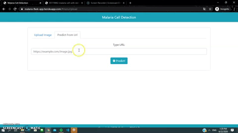

# Malaria Cell Image Classification

## Overview

Malaria is a life-threatening disease. It’s typically transmitted through the bite of an infected Anopheles mosquito. Infected mosquitoes carry the Plasmodium parasite. When this mosquito bites, the parasite is released into bloodstream.
The goal of this project is to build a model that can detect malaria parasites in a cell image. The model will analyze a segmented red blood cell image and classify it as either "uninfected" or "parasitized".


Dataset can be found [here](https://www.kaggle.com/iarunava/cell-images-for-detecting-malaria)

The application can be seen [here](https://malaria-flask-app.herokuapp.com/)


## Requirements

| Package | Version |
| ------ | ------ |
| [Python] | 3.7.6 |
| [Flask] | 1.1.2 |
| [Tensorflow] | 2.2.0 |
| [Pillow] | 7.1.2 |
| [Scikit-Image] | 0.17.2 |
| [Numpy] | 1.18.5 |
| [Werkzeug] | 1.0.1 |
| [h5py] | 2.10.0 |
| [gunicorn] | 20.0.4 |
| [gevent] | 20.6.2 |

All packed in *[requirements.txt]*

## Installation

Make sure you have Python 3 Installed, and then install the dependencies.

```bash
pip install -r requirements.txt
```

To start the server using Flask:

Linux and MacOS:
```bash
export APP_FLASK=[path/to/project]/app.py
flask run
```
Windows:
```bash
set APP_FLASK=[path/to/project]/app.py
flask run
```
Or if you have jupyter notebook installed, you can also load the [notebook_app.ipynb](https://github.com/fikhrimasri/Malaria-Cell-Classification/blob/master/notebook_app.ipynb)

Check if the server is started by going to browser and input url

```bash
localhost:5000
```
## Authors

* **Fikhri Masri** --- [fikhrimasri](https://github.com/fikhrimasri)
* **Dimas Anom Priyayi** --- [priyayidimas](https://github.com/priyayidimas)

## Demo

### Using Upload
<p align="center">
  
</p>

### Using URL
<p align="center">
  
</p>


[//]: # (This is simple comments)


[requirements.txt]:https://github.com/fikhrimasri/Malaria-Cell-Classification/blob/master/requirements.txt
[Python]:https://www.python.org/downloads/release/python-376/
[Flask]:https://flask.palletsprojects.com/en/1.1.x/
[Tensorflow]:https://www.tensorflow.org/
[Pillow]:https://pillow.readthedocs.io/en/stable/#
[Scikit-Image]:https://scikit-image.org/
[Numpy]:https://numpy.org/
[Werkzeug]:https://werkzeug.palletsprojects.com/en/1.0.x/
[h5py]:https://www.h5py.org/
[gunicorn]:https://gunicorn.org/
[gevent]:http://www.gevent.org/
